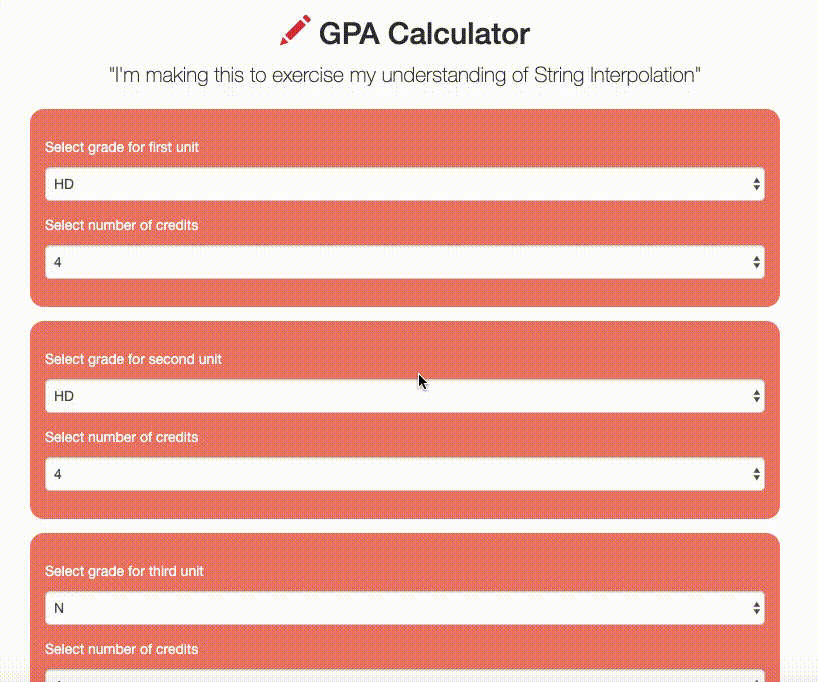

# Angular GPA Calculator

This is a simple GPA calculator I developed after learning about String Interpolation in Angular. 

See project tutorial here: https://medium.com/@apurbaakash/coding-your-first-angular-app-with-string-interpolation-5968937bd6a8?source=friends_link&sk=ec2c41d18a413b8696bdeae8a38b082c

This project was generated with [Angular CLI](https://github.com/angular/angular-cli) version 8.1.0.

## Development server

Run `ng serve` for a dev server. Navigate to `http://localhost:4200/`. The app will automatically reload if you change any of the source files.

